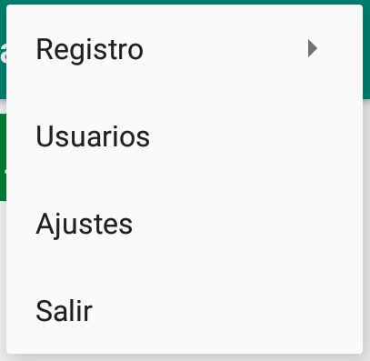
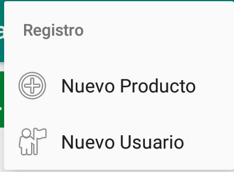
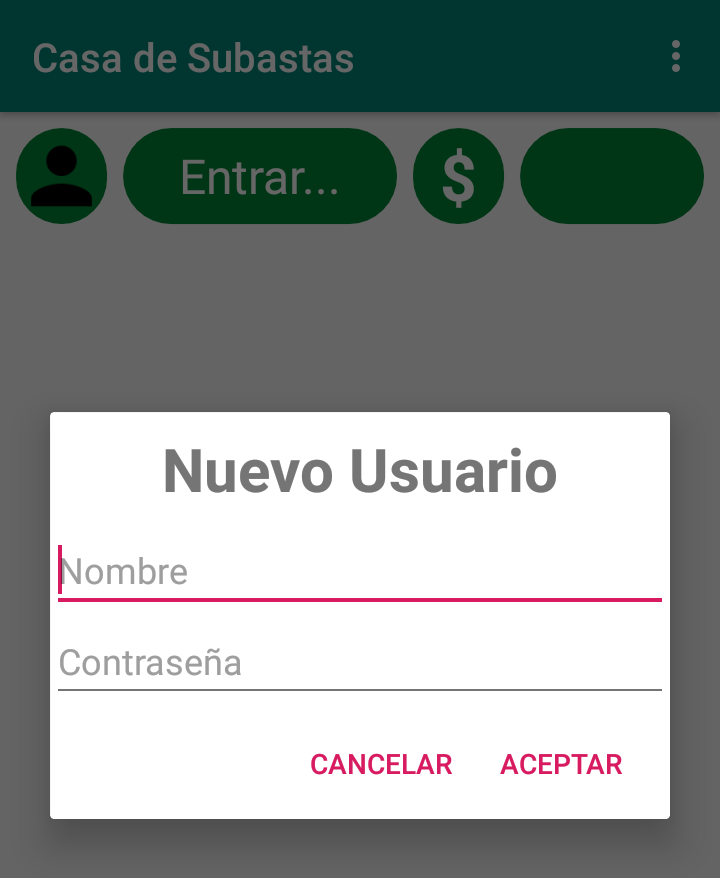
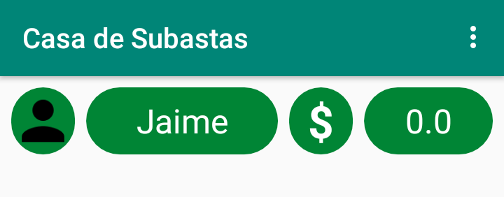
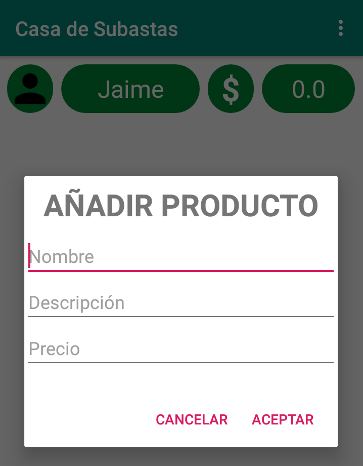
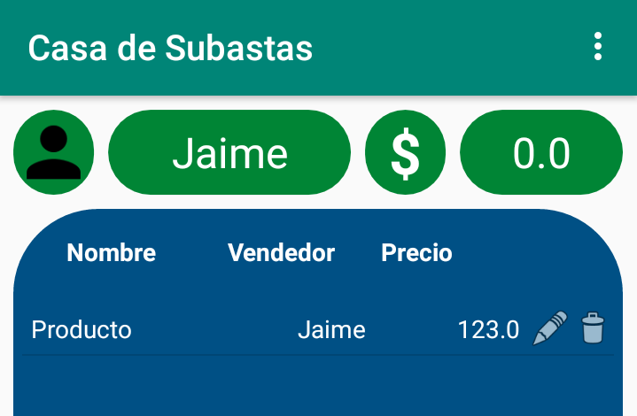
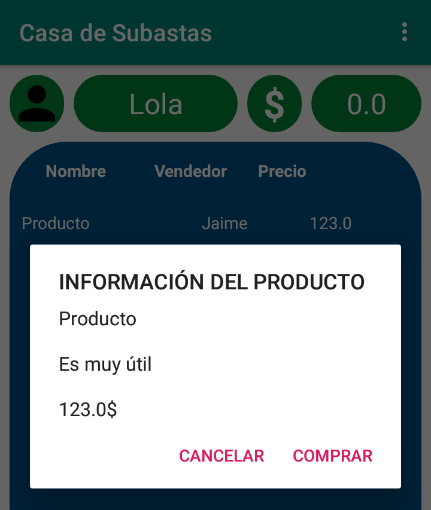
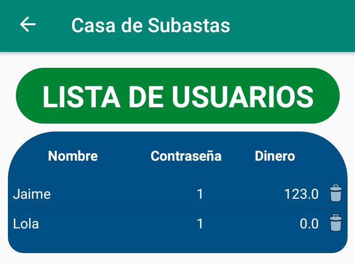

# Casa de Subastas
Esto es un proyecto realizado para el Curso de Creación de Aplicaciones Móviles (APPs para Android) (Vigo)

La aplicación consta de dos actividades:
1. Actividad de productos, donde registrar nuevos productos y ususarios, que pueden editar y borrar productos si los han registrado ellos, 
y comprarlos si son de otro usuario.
2. Actividad de usuarios, donde consultar el saldo y con la posibilidad de borrar.

La aplicación consta de dos bases de datos:
1. Lista de productos.
2. Lista de usuarios.

Al iniciar la aplicación por primera vez, ambas listas están vacías, por lo que en primer lugar hay que registrar a un usuario. Para ello 
se selecciona en el menú Varios->Registrar->Nuevo Usuario.

Se abrirá un diálogo donde introducir un nombre de usuario y contraseña. No puede haber dos usuarios con el mismo nombre.

Una vez registrado, el nuevo usuario tendrá su sesión ya abierta. Se puede consultar su nombre y saldo, que por defecto es 0. Para cerrar e iniciar una nueva sesión se selecciona la región de información de usuario.

El usuario con la sesión abierta puede registrar nuevos productos en el menú Varios->Registrar->Nuevo Producto. Se abrirá un diálogo donde introducir el nombre, descripción y precio del producto.

Al registrarlo aparecerá una lista con los productos registrados, mostrando su nombre, el vendedor y el precio. El usuario que registrara el producto podrá editarlo o borrarlo.

Al seleccionar un producto se abrirá un diálogo donde ver la información completa del producto. Además si lo ha seleccionado un usuario diferente al que lo registró, podrá comprarlo.

De esta forma se borrará el producto de la lista y se sumará al saldo del usuario que lo registrara el precio del producto.

